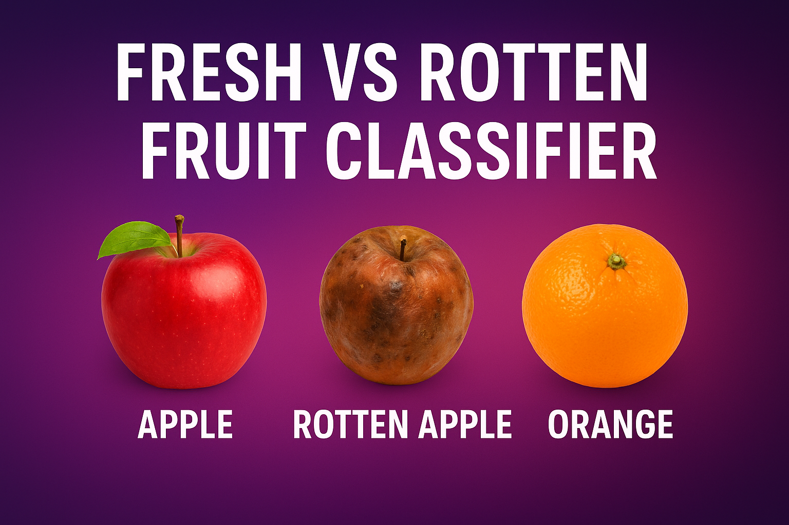
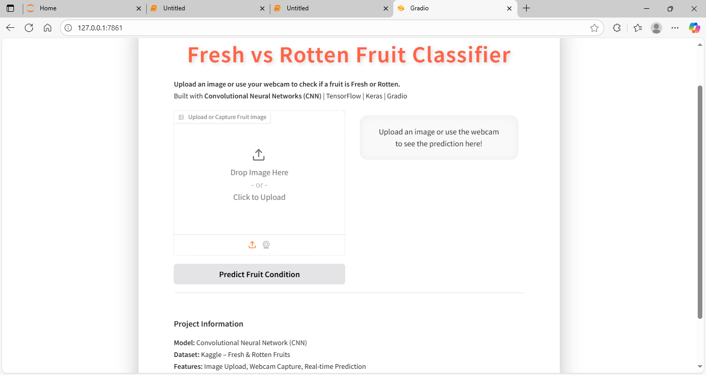
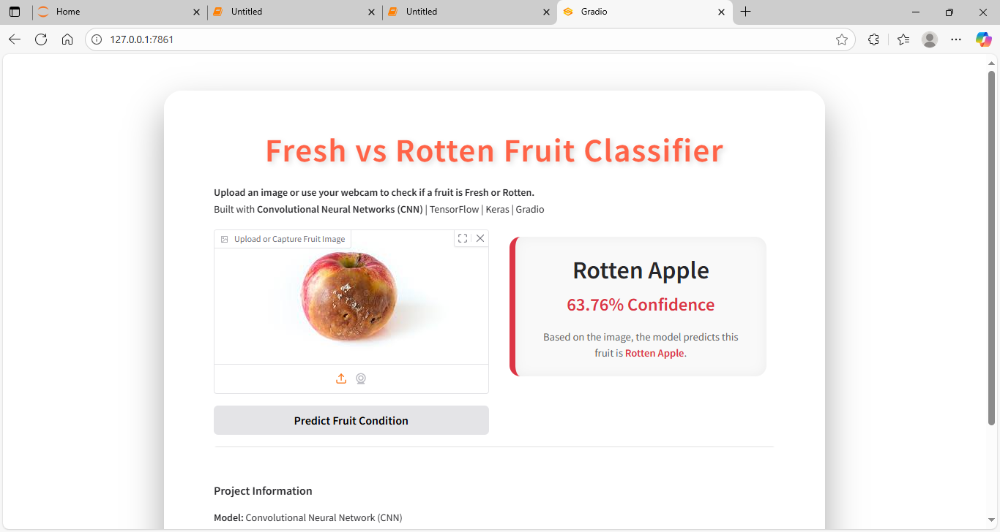
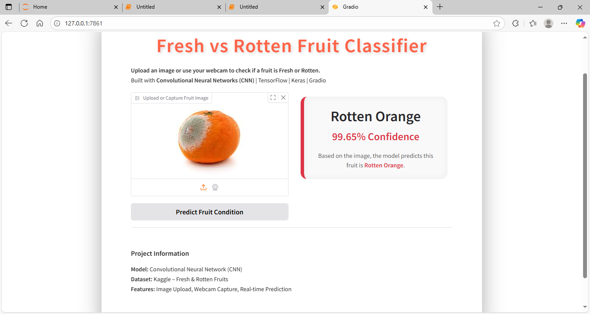
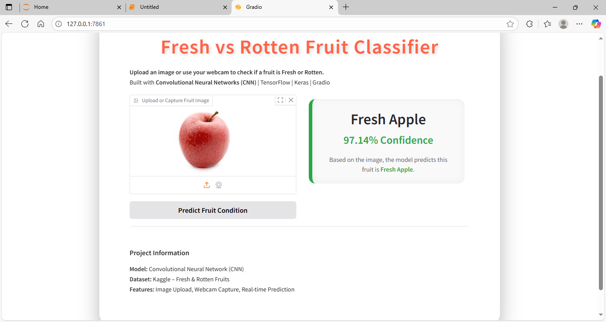

# 🍎🍌🍊 Fresh vs Rotten Fruit Classifier  

A **Convolutional Neural Network (CNN)** project that classifies fruits as **Fresh** or **Rotten**.  
Currently supports **Apple, Banana, and Orange**.  


This project demonstrates how **Computer Vision + Deep Learning** can solve real-world problems such as:  
- ✅ Food quality control  
- ✅ Reducing food waste  
- ✅ Smart grocery systems  

---

## 🚀 Project Pipeline  

1. **Import Libraries** – TensorFlow, Keras, NumPy, Matplotlib, Gradio  
2. **Load Dataset** – [Fresh & Rotten Fruits (Kaggle)](https://www.kaggle.com/datasets/sriramr/fruits-fresh-and-rotten-for-classification)  
3. **Preprocess Images** – Resize (150x150), normalize, and apply augmentation  
4. **Build CNN Model** – Conv2D + MaxPooling + Flatten + Dense + Dropout  
5. **Train & Evaluate** – 10 epochs on 13k+ fruit images  
6. **Save & Reload Model** – for inference  
7. **Predict on New Images** – single image classification  
8. **Frontend with Gradio** – Upload an image & get prediction instantly  

---

## 🧠 Model Architecture  

- **Conv2D** → extracts features (shapes, colors, textures)  
- **MaxPooling2D** → reduces dimensions, keeps key info  
- **Flatten** → converts 2D → 1D vector  
- **Dense Layers** → decision-making  
- **Softmax** → outputs probability for each fruit class  

---

## 📊 Training Performance  

- **Training Accuracy:** ~90%  
- **Validation Accuracy:** ~93%  
- **Epochs:** 10  


---

## 🎨 Gradio App  

The project includes a **Gradio-powered web interface** for real-time fruit freshness detection.  

### 🔹 App Interface  
  

### 🔹 Prediction Examples  
- 🍎 Rotten Apple  
    

- 🍊 Rotten Orange  
    

- 🍏 Fresh Apple  
    

---

## ⚙️ Tech Stack  

- **Python** 🐍  
- **TensorFlow / Keras** 🤖  
- **NumPy & Matplotlib** 📊  
- **Gradio** 🎨 (for UI)  

---

## 🌍 Business Problem Solved  

- Helps in **automating fruit quality checks**.  
- Useful for **supermarkets, warehouses, and farmers**.  
- Can reduce **manual inspection errors** and **food waste**.  

---

## ⚠️ Limitations  

- Works only for **3 fruits** (Apple, Banana, Orange).  
- Dataset size is **limited (~13k images)** → not perfect for unseen fruits.  
- Needs **more data & deeper architectures** for production use.  

---

## 📌 Future Improvements  

- Extend to **more fruit types & vegetables**.  
- Deploy as a **mobile app / cloud API**.  
- Use **Transfer Learning (e.g., ResNet, EfficientNet)** for higher accuracy.  

---

## 🏆 Conclusion  

This project demonstrates how **Deep Learning + Computer Vision** can classify fruit freshness.  
Despite dataset limitations, it achieves **93% validation accuracy** and shows potential for real-world applications.  

🔗 *Try it yourself by running:*  
```bash
python app.py
````

(Gradio will launch at **[http://127.0.0.1:7860](http://127.0.0.1:7860)**)

---

👨‍💻 **Author:** Akshay Bhujbal

