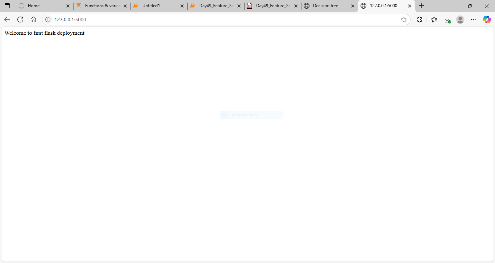

# 🚀 First Flask Web App

This is my **first web application using Flask**, created as part of my Python journey.  
Flask is a micro web framework that lets you build websites using just Python.

---

## 📚 What You Will Learn from This Project

- How to install and run a Flask app.
- What `Flask`, `route`, and `app.run()` mean.
- How to open the app in a browser.
- How a simple backend project works compared to frontend tools like Streamlit, Gradio, and Tkinter.

---

## 🛠️ How to Run

1. Make sure Flask is installed:

   ```bash
   pip install flask


2. Run the app:

   ```bash
   python app.py
   

3. You will see a message like:

   ```
   WARNING: This is a development server. Do not use it in a production deployment. Use a production WSGI server instead.
   * Running on http://127.0.0.1:5000

   
4. Open your browser and go to:

   ```
   http://127.0.0.1:5000
   ```

   You should see:

   ```
   Welcome to first flask deployment
   ```

---

## 📸 Screenshot

Here is what the running app looks like in the browser:



---

## 🧠 Notes

* This is just the **backend logic**, not a fancy frontend.
* Unlike Streamlit or Gradio, Flask gives you full control over backend + frontend design (like HTML, CSS).
* We'll expand this app with routes, templates, forms, etc., later.

---

## 📁 File Structure

```
Flask_Basics/
├── app.py
├── flask_app_screenshot.png
└── Day49_Flask_Introduction_and_First_Web_App.ipynb
```

---

## ✅ Next Steps

* Learn about Flask templates (HTML files)
* Add multiple routes and URL parameters
* Connect with forms and databases
